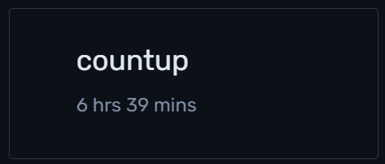

# countup

Lemonews is a news outlet with subscription option which sends weekly newsletter to its subscribers. The page shows a promotional UI that displays the number of subscribers on the homepage.

How to run the project:

1. Clone the repo
2. Go inside the /app folder
3. Run `npm install`
4. Run `npm run dev`

Or view live on [the deployed web](https://lemonews-countup.web.app)

Code explanation:

- The subscribers count starts from 1 (`startValue`) and ends at 147 (`endValue`) in 3 seconds (`duration`, converted to 3000ms).
- Subscribers counter display is declared as `count` and updated using React hooks state management (useState) `setCount`. The counter (`currentValue`) is handled as an animation using `requestAnimationFrame` for smooth transition. The animation starts when `counter = requestAnimationFrame(countUp)` is executed, which calls the `countUp` function repeatedly, each call calculates new `currentValue`. When the `currentValue` changes, it is set as `count` by `setCount(currentValue)` and triggers React re-render which automatically updates the display.
- `startTime` is the time when the effect runs, holds role as the fixed reference point. `elapsed` tracks time since the animation started, it increases with each call of `countUp` function.
- The counting process from start to end is monitored by `progress` with max value 1 (when the `duration` is reached), using `Math.min` to prevent progress to go over 1. With the increasing `elapsed` time, also increases progress from 0 (at 0ms) until 1 (at 3000ms). If the `progress` has yet to reach 1, the counter is called repeatedly, changing the `currentValue` based on the proportion of the difference of `startValue` and `endValue`, rounded using `Math.floor` into whole numbers (no decimal). The loop continues until `progress` reaches 1 (`currentValue` equals to `endValue`), animation is completed and stops automatically. `cancelAnimationFrame` works as the cleanup function to prevent memory leaks.
- At first, the `finished` state is set as `false` using state management `setFinished`. The letter "M" display is set to appear if the `finished` state is `true` using conditional logical `&&` operator. After the `count` completes and reaches `endValue`, the `finished` state changes into `true` by `setFinished(true)` which triggers the "M"/millions suffix to appear after the counter number.

Working log:
6 hours 39 minutes

